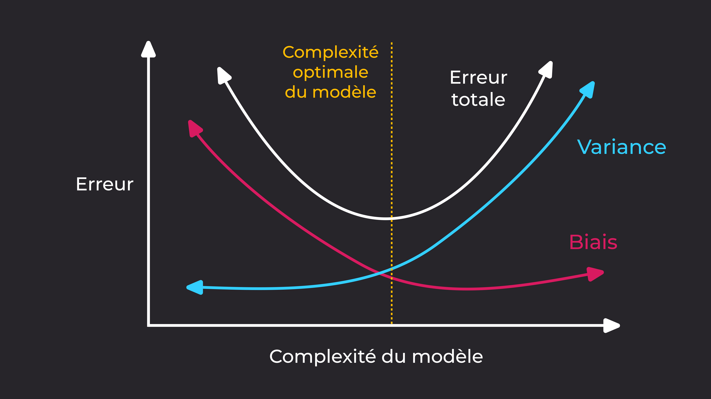

# OCR_basic_machine_learning

[Tutoriel](https://openclassrooms.com/fr/courses/4011851-initiez-vous-au-machine-learning) : https://openclassrooms.com/fr/courses/4011851-initiez-vous-au-machine-learning

## Partie 1 : Le domaine de la Data Science

### Le cycle de travail


- Récupération des données : source -> BDD, images, sons, textes, ...
- Nettoyer les données : S'assurer de la consistance des données, l'exclusion des valeurs aberrantes, gérer les valeurs manquantes
- Explorer les données :  Cette étape permet de mieux comprendre les différents comportements et de bien saisir le phénomène sous-jacent.  
Lorsque l'on a simplement besoin de comprendre ses données et les explorer, on peut faire appel à un **data analyst**. Ou bien un data analyst peut effectuer des études préliminaires avant de laisser le travail de modélisation au **data scientist**.
- Modélisez les données : C'est la création du modèle statistique associé aux données qui nous intéressent. C'est ce qu'on appelle le machine learning (ou apprentissage automatique).
- Evaluer & Interpréter : C'est connaitre la capacité qu'a notre modèle à représenter avec exactitude un phénomène, ou a minima sa capacité à résoudre la problématique. Cette étape doit s'accompagner de graphiques explicites.
- Mise en production : Rendre accessible l'exploitation de notre modèle via une API par exemple. Si la mise à l'échelle, le temps des calculs, le temps de réponses est trop long et qu'il faut une architecture plus poussée, on peut faire appel à un **data architect**

### L'étape de Modélisation


### Algorithme d'Apprentissage
- Régression Linéaire
- k-NN
- Support Vector Machine (SVM)
- Réseaux de neurones
- Random forests
- ...

### Types d'Apprentissage

- **Supervised learning** : On va récupérer des données dites annotées de leurs sorties pour entraîner le modèle, c'est-à-dire que les données sont déjà associées un label ou une classe cible et l'on veux que l'algorithme devienne capable, une fois entraîné, de prédire cette cible sur de nouvelles données non annotées.
- **Unsupervised learning** : Les données d'entrées ne sont pas annotées. L'algorithme d'entraînement s'applique dans ce cas à trouver seul les similarités et distinctions au sein de ces données, et à regrouper ensemble celles qui partagent des caractéristiques communes.
- **Semi-supervised** : L'algorithme prend en entrée certaines données annotées et d'autres non. Ce sont des méthodes très intéressantes qui tirent parti des deux mondes (supervised et unsupervised), mais bien sûr apportent leur lot de difficultés.
- **Reinforcement learning** : L'algorithme se base sur un cycle d'expérience / récompense et améliore les performances à chaque itération. Une analogie souvent citée est celle du cycle de dopamine : une "bonne" expérience augmente la dopamine et donc augmente la probabilité que l'agent répète l'expérience.

### Types de problématique

- **Classification Binaire** : On attend comme sortie une valeur binaire qui correspond à chacune de nos classes.
- **Classification Multi-label** : On attend comme sortie une probabilité d'appartenance à chaque classe.
- **Régression** : On attend comme sortie une valeur continue, un nombre.

## Partie 2 : Entrainement d'un modèle k-NN

### Jeu de données : Mnist

Example :  


Choix de la valeur k :
```python
k_np = np.arange(1, 16, 1)
errors = np.zeros(15, dtype=float)
knn = neighbors.KNeighborsClassifier()

for k in k_np:
    knn.n_neighbors = k
    knn.fit(xtrain, ytrain)
    errors[k-1] = 1 - knn.score(xtest, ytest)
```

  
Taux d'erreur d'environ 5% pour k = 4.

Mise en avant des echecs de prédiction :  


## Partie 3 : Limites et problème du ML

- **Le théorème "No Free Lunch"** : Il n'existe pas d'algorithme et modèle "ultime", applicable pour tous les problèmes.
- **Les problèmes insolubles** : Appelée intractability en anglais, cette notion désigne les problèmes qui ne peuvent être résolus dans un temps raisonnable, qui explosent en terme de complexité algorithmique.
- **Variance** : Désigne une dépendance très forte au training set, autrement dit une variation très forte de la décision en fonction des données d'entraînement. Cette variabilité est appelée, à juste titre, variance du modèle.
- **Biais** : Correspond en quelque sorte à quel point on vise à côté de la "vraie" valeur d'un point considéré.  



En utilisant un modèle comportant une trop grande complexité – dit "à haute variance" – on peut mal capturer le phénomène sous-jacent et devenir trop dépendant aux données d'entraînement et aux petites fluctuations aléatoires, non représentatives du phénomène.

A contrario, il ne faut pas choisir un modèle trop "simple" qui biaise le résultat et ne parvient pas à capturer toute la complexité du phénomène.

- **Overfitting** : Désigne le fait que le modèle que vous avez choisi est trop collé aux données d'entraînement. C'est un problème classique de data science, lorsqu'on choisi un modèle trop "flexible", c'est-à-dire avec une complexité trop élevée qui prend aussi en compte le bruit du phénomène. C'est en fait ce qui arrive aux méthodes à haute variance.
- **Underfitting** : Désigne une situation où le modèle n'est pas du tout assez complexe pour capturer le phénomène dans son intégralité. Les algorithmes avec un biais élevé ont tendance à underfitter plus facilement les données d'entraînement, et donc à rater des informations importantes sur le phénomène.
- **Fléau de la dimension** (curse of dimensionality) : Si on augmente le nombre de features, il devient de plus en plus difficile d'avoir assez de données d'entraînement aux alentours pour pouvoir effectuer une prédiction correcte.
